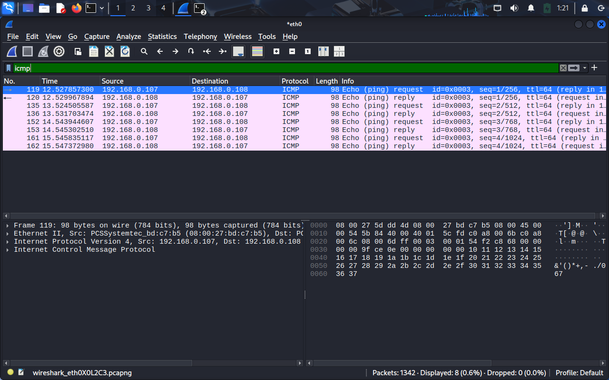
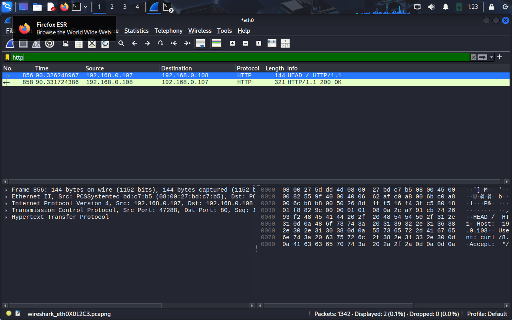
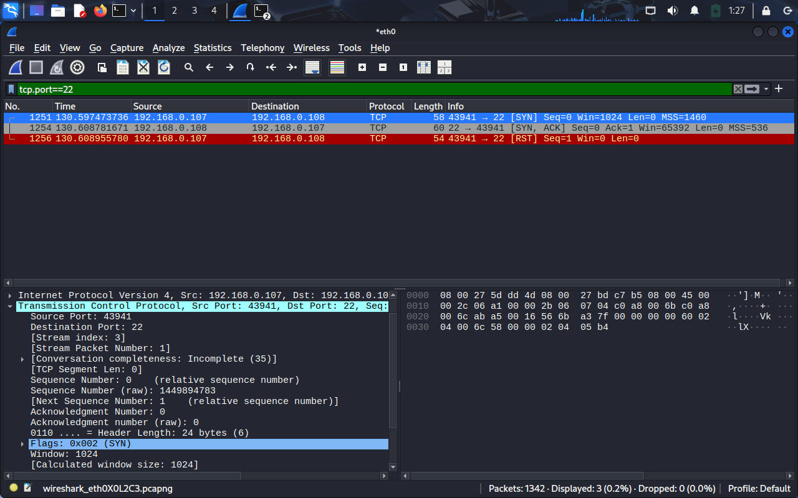

# 🧪 Laboratorio Wireshark – Análisis de Tráfico de Red

## 🎯 Objetivo

Analizar y documentar el tráfico de red entre dos hosts en una red local, identificando protocolos, eventos clave y servicios expuestos mediante el uso de **Wireshark**.

---

## 🖥️ Entorno del Laboratorio

* **Máquina origen:** 192.168.0.107
* **Máquina destino:** 192.168.0.108
* **Herramienta utilizada:** Wireshark

---

## 🔍 Análisis del Tráfico Capturado

### 1. Conectividad Básica (ICMP)

* Se observaron **ICMP Echo request/reply (ping)** entre 192.168.0.107 y 192.168.0.108.
* Esto confirma la conectividad a nivel de capa de red.

**Filtro aplicado:**

```wireshark
icmp
```

*Evidencia:*


---

### 2. Tráfico Web (HTTP)

* El host **192.168.0.107** realizó una petición `HTTP HEAD / HTTP/1.1` al servidor **192.168.0.108** en el puerto **80**.
* El servidor respondió con **200 OK**, confirmando que el servicio HTTP está activo.

**Filtro aplicado:**

```wireshark
http
```

*Evidencia:*


---

### 3. Conexión SSH (TCP – Puerto 22)

* Intento de conexión desde **192.168.0.107** (puerto 43941) hacia **192.168.0.108** (puerto 22).
* Se observa el **handshake de 3 vías**:

  * Paquete #1251 → **SYN** (cliente → servidor)
  * Paquete #1254 → **SYN-ACK** (servidor → cliente)
  * Paquete #1255 → **ACK** (cliente → servidor)
* La sesión fue interrumpida por un paquete **RST** enviado desde el cliente.

**Filtro aplicado:**

```wireshark
tcp.port == 22
```

*Evidencia:*


---

## 🛠️ Técnicas de Filtrado en Wireshark

Durante el análisis se aplicaron distintos filtros para aislar protocolos y hosts específicos:

* `icmp` → Tráfico de ping.
* `http` → Tráfico web.
* `tcp.port==22` → Conexiones SSH.
* `ip.addr==192.168.0.108` → Todo el tráfico relacionado con el host destino.

---

## 📊 Resultados y Aprendizaje

* Se confirmó la **conectividad** entre los hosts usando ICMP.
* Se identificó un servicio **HTTP activo** en el puerto 80.
* Se detectó un intento de conexión **SSH en el puerto 22**, que fue interrumpido.
* Se reforzó la comprensión del **handshake TCP de 3 vías** y de cómo Wireshark permite visualizarlo.
* Este laboratorio demuestra habilidades en:

  * Identificación de protocolos de red.
  * Uso de filtros avanzados en Wireshark.
  * Documentación técnica de tráfico real.

